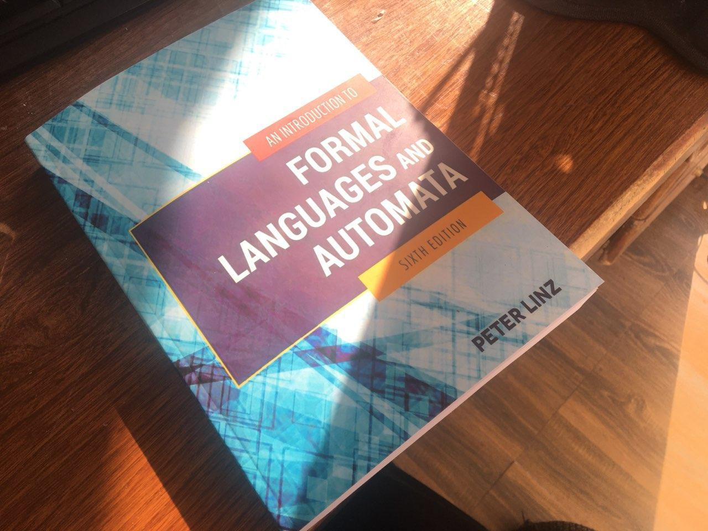

# CFG2CNF

Python tool able to convert a Context Free Grammar in Chomsky Normal Form

## Convert a Context Free Grammar to Chomsky Normal Form

Python program to convert a Context Free Grammar to Chomsky Normal Form.

I read 7 chapters of the book and the result of my study was writing this program.

### References: Formal Languages and Automata



An Introduction to Formal Languages and Automata **by Peter Linz**

#### What is Chomsky Normal Form

Chomsky Normal Form is a context-free grammar that has been put into a specific format. It was developed by Noam Chomsky in 1978 and is part of formal language theory.

https://en.wikipedia.org/wiki/Chomsky_normal_form

#### What is Context Free Grammar

https://en.wikipedia.org/wiki/Context-free_grammar

### Using

```
git clone https://github.com/BaseMax/CFG2CNF
cd CFG2CNF
python main.py
```

### Input

```
S -> SaB | aB
B -> bB | $
*
```

The above grammar is equivalent to the following grammar:

```
S -> SaB
S -> aB
B -> bB
B -> $
*
```

## Automata is useful?

The image below will change your think of the Automata:


Sure, We are need this subject all of the day, Also programming languages!

Follow this way by reading following **book**.

If you find a problem or bugs in program, please send **Issue** or **PR**, i'm a new member in this study...

### Automata Videos

Learn in some videos:

- https://www.youtube.com/watch?v=5_tfVe7ED3g
- https://stackoverflow.com/questions/3510109/how-can-i-determine-if-a-language-is-context-free-or-not#:~:text=First%2C%20you%20should%20attempt%20to,the%20language%20is%20context-free
- https://www.youtube.com/watch?v=mlXYQ8ug2v4&list=PLBlnK6fEyqRgp46KUv4ZY69yXmpwKOIev&index=77
- https://www.youtube.com/watch?v=Mh-UQVmAxnw&list=PLBlnK6fEyqRgp46KUv4ZY69yXmpwKOIev&index=78
- https://www.youtube.com/watch?v=FNPSlnj3Vt0&list=PLBlnK6fEyqRgp46KUv4ZY69yXmpwKOIev&index=79
- https://www.youtube.com/watch?v=ZCbJan6CGNM&list=PLBlnK6fEyqRgp46KUv4ZY69yXmpwKOIev&index=80
- ...

Thanks to Khalilian for providing these videos and the great help he did.

---------

# Max Base

My nickname is Max, Programming language developer, Full-stack programmer. I love computer scientists, researchers, and compilers. ([Max Base](https://maxbase.org/))

## Asrez Team

A team includes some programmer, developer, designer, researcher(s) especially Max Base.

[Asrez Team](https://www.asrez.com/)

