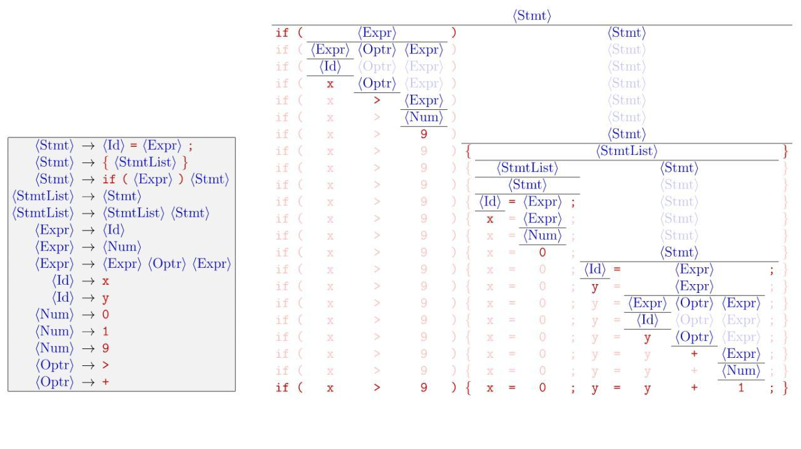

# CFG2CNF

## Convert a Context Free Grammar to Chomsky Normal Form

Python program to convert a Context Free Grammar to Chomsky Normal Form.

I read 6 chapters of the book and the result of my study was writing this program.

### References: Formal Languages and Automata


An Introduction to Formal Languages and Automata **by Peter Linz**

### Using

```
git clone https://github.com/BaseMax/CFG2CNF
cd CFG2CNF
python main.py
```

### Input

```
S -> SaB | aB
B -> bB | $
*
```

The above grammar is equivalent to the following grammar:

```
S -> SaB
S -> aB
B -> bB
B -> $
*
```

## Automata is useful?

The image below will change your think of the Automata:



Sure, We are need this subject all of the day, Also programming languages!

Follow this way by reading following **book**.

If you find a problem or bugs in program, please send **Issue** or **PR**, i'm a new member in this study...

---------

# Max Base

My nickname is Max, Programming language developer, Full-stack programmer. I love computer scientists, researchers, and compilers. ([Max Base](https://maxbase.org/))

## Asrez Team

A team includes some programmer, developer, designer, researcher(s) especially Max Base.

[Asrez Team](https://www.asrez.com/)

